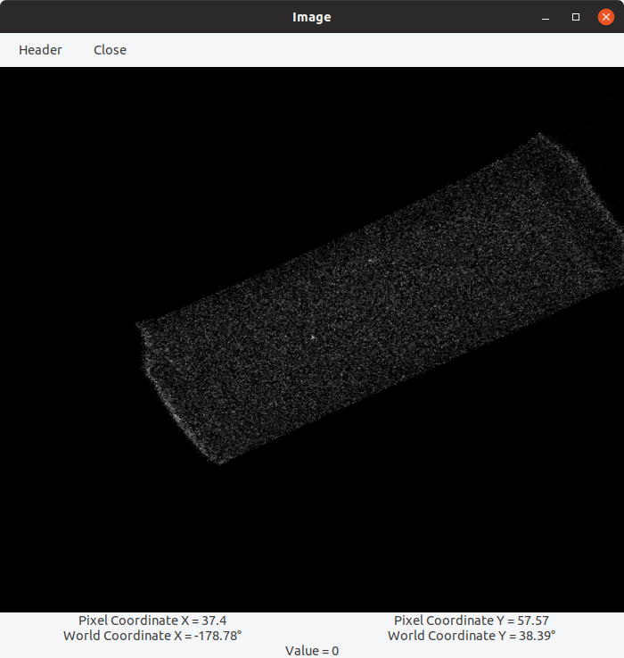
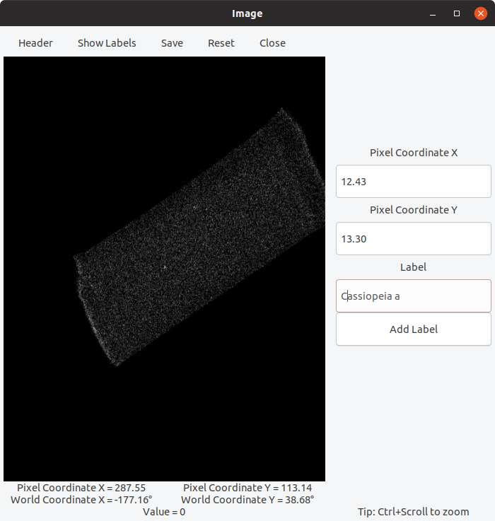
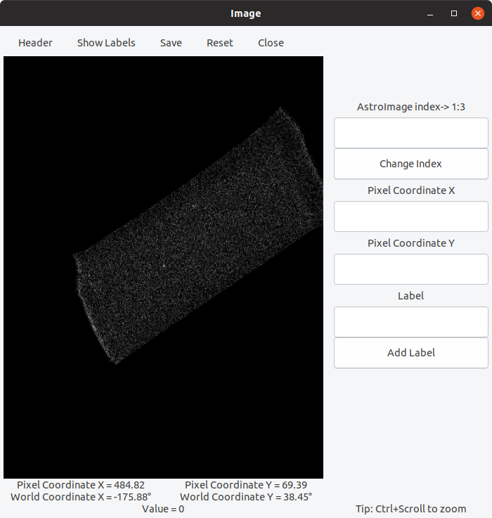

# AstroImageView

[](https://travis-ci.org/aquatiko/AstroImageView.jl)
[](https://coveralls.io/github/JuliaAstro/AstroImageView.jl?branch=master)
[](https://ci.appveyor.com/project/aquatiko/astroimageview-jl/branch/master)

Introduction
------------

`AstroImageView.jl` provides a Graphical User Interface to `AstroImages.jl` package.

Installation
------------

`AstroImageView.jl` is available for Julia 1.0 and later versions, and can be
installed with [Julia built-in package
manager](https://docs.julialang.org/en/v1/stdlib/Pkg/).

```julia
pkg> add AstroImageView.jl
```

Usage
-----

After installing the package, you can start using it with

```julia
julia> using AstroImageView
```

Basic GUI panel
-----
To start the basic panel you can use:
```julia
julia> img = AstroImage("file.fits")
AstroImage{Int16,ColorTypes.Gray,1,Float64}[...]

julia> ui_basic(img)
```
This will open a GUI window like this:



Hover the mouse pointer over the displayed image to see pixel and world coordinates of the pixel under the pointer and the pixel value in real-time.
Header button shows the WCS header info. of the currently displayed image.

You can also Ctrl+Scroll to Zoom In/Out image on the canvas.

Optionally if your `AstroImage` contains more than one images, you can display the particular index using:
```julia
julia> ui_basic(img, index)
```


Advanced GUI panel
-----
To start the advanced panel you can use:
```julia
julia> img = AstroImage("file.fits")
AstroImage{Int16,ColorTypes.Gray,1,Float64}[...]

julia> ui_advanced(img)
```
This will open a GUI window like this if your `AstroImage` contains a single image:




If it contains multiple images:


Apart from all functionalities of the basic panel:
- It shows the index range of your current `AstroImage`. You can enter a valid index to display another image present in your `AstroImage`.

- Changing the index shows the header of that particular image.

- You can directly add interesting labels for pixel coordinates. All added labels in the current session can be viewed by `Show Labels` button.

- `Save` button adds your marked labels to your `AstroImage`.

- `Reset` clears all labels and resets state of `AstroImage`.

More functionalities to the advanced panel are under development as will be available in further releases.

License 
-----
The `AstroImageView.jl` package is licensed under the MIT "Expat" License. The original author is Rohit Kumar.
